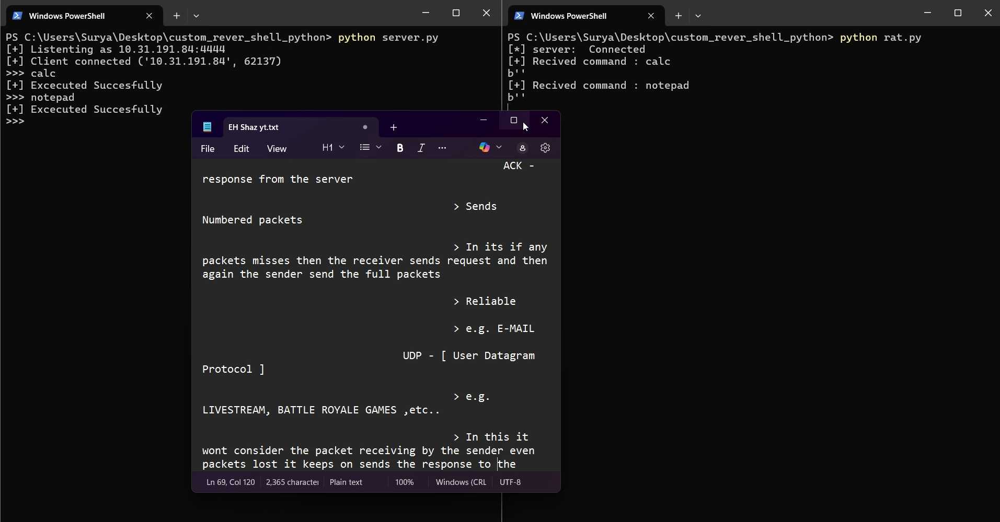

# 🔄 Python Reverse Shell (Educational Project)
---
### 📌 About

This project demonstrates how a reverse shell works using Python’s built-in libraries (socket, subprocess).
It is built for educational and awareness purposes only — showing how attackers may gain remote access and why network monitoring & firewalls are important.
<p colour="red"> And this is for <strong >Educational Purpose </strong></p>
<center>
  <h5>
    <a href="https://github.com/Suryaprasath11/"> @Surya Prasath </a>
  </h5>
</center>
---

# ⚠️ Disclaimer:
This project must only be used in a controlled lab or localhost environment.
Do NOT use this code against any system you do not own or have explicit permission to test.

---
## 🛠 Features

Attacker (Server) script that listens for connections.

Victim (Client) script that connects back to attacker.

Execute system commands remotely.

Send back results to attacker.

Exit cleanly using exit command.

---

 ### 📂 Project Structure
    custom_rever_shell_python/
    |
    │── server.py   # Attacker script (listener)
    |
    │── rat.py   # Victim script (reverse shell)
    |
    │── README.md   # Documentation

---

### ⚙️ Requirements

  => Python 3.x
  
  => Works on Linux, Windows, or macOS
  
  => No external dependencies (only built-in libraries)

---

### 🚀 Usage
  1️⃣ Start the Listener (Attacker)
  python3 server.py
  
  2️⃣ Run the Reverse Shell (Victim)
  python3 client.py
  
  3️⃣ Interact
  
  Type commands in the server terminal.
  
  The client executes them and sends output back.
  
  Type exit to close the session.

---
## 🔍 Example Demo

<center>
  <p>
    
    
  </p>
</center>

Server side:
```

  [+] Listening for connections...
  [+] Connection established from 127.0.0.1
  shell> whoami
  user
  shell> dir
  Desktop  Documents  Downloads
  shell> exit

```
---
### 📖 Learning Outcomes

By building this project, you’ll understand:

How TCP sockets enable remote connections.

How reverse shells bypass firewalls (outbound connections).

Why monitoring outbound traffic is important.

Basics of command execution via Python.

---

# <strong> 🛡 Defense Awareness </strong>

Use firewalls to block suspicious outbound connections.

Monitor network traffic for anomalies.

Apply least privilege principles to user accounts.

Always patch and update systems.

---

## 📌 License

This project is released under the MIT License for educational purposes only.

---
